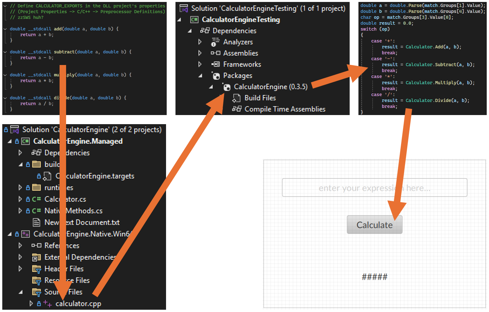

# CalculatorEngine_NuGet

Supporting .NET solution to build a C++ DLL NuGet package that is used by the CalculatorEntine_Optix project.  
The purpose of this project was not to make a calculator but to learn how to get some C++ into Optix via NuGet.
  
The solution file contains two projects currently, one as a c# wrapper project for the core DLL calculator engine project.  
Future enhancement will be to add the core SO calculator engine project for Linux.  
A supporting build file will select the appropriate library file based on the host OS.
Currently Windows only.

The example image below illustrates the path from the cpp file to the Optix runtime.  
The supporting .NET solution for the NuGet build is named CalculatorEngine_NuGet

## Disclaimer
Rockwell Automation maintains these repositories as a convenience to you and other users. Although Rockwell Automation reserves the right at any time and for any reason to refuse access to edit or remove content from this Repository, you acknowledge and agree to accept sole responsibility and liability for any Repository content posted, transmitted, downloaded, or used by you. Rockwell Automation has no obligation to monitor or update Repository content

The examples provided are to be used as a reference for building your own application and should not be used in production as-is. It is recommended to adapt the example for the purpose and observing the highest safety standards.
